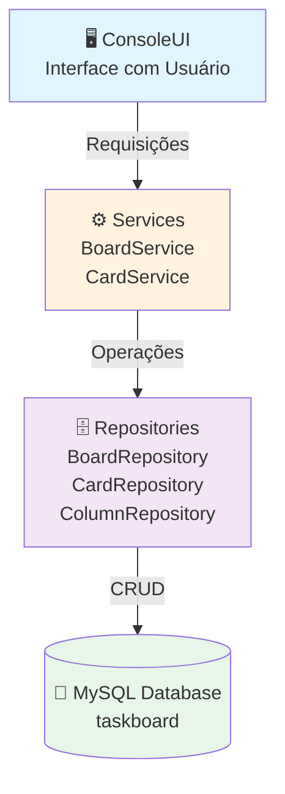
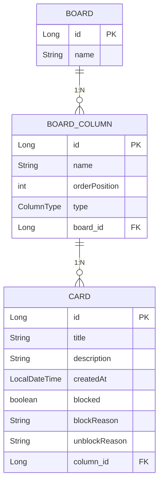
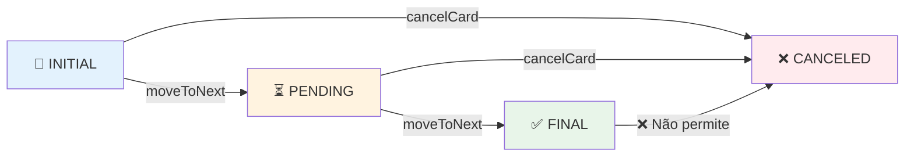
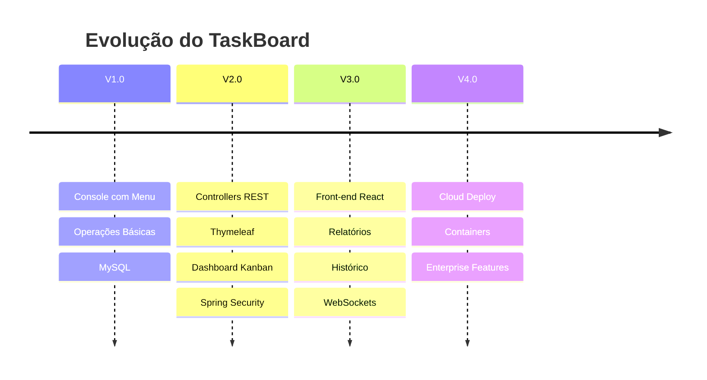

# 🗂 TaskBoard - Gerenciador de Tarefas (Console + Spring Boot)

Sistema de gerenciamento de boards e tarefas desenvolvido com **Spring Boot**, **JPA** e **MySQL**, seguindo arquitetura em camadas e preparado para futura evolução para interface Web com Thymeleaf.

---

## 📌 Objetivo

Construir um sistema de gerenciamento de tarefas com:

- ✅ Boards customizáveis
- ✅ Controle de colunas com regras específicas
- ✅ Movimentação controlada de cards
- ✅ Controle de bloqueio/desbloqueio
- ✅ Persistência em banco de dados MySQL
- ✅ Arquitetura preparada para evolução futura

---

## 🏗 Arquitetura do Projeto

O projeto segue separação clara de responsabilidades:

```
ui → Interface (Console)
service → Regras de negócio
repository → Acesso a dados
entity → Modelagem do domínio
```

### 📊 Diagrama de Camadas



---

## 🗄 Modelo de Domínio

### 📌 Entidades

#### **Board**
```java
- id: Long (PK)
- name: String
- columns: List<BoardColumn> (1:N)
```

#### **BoardColumn**
```java
- id: Long (PK)
- name: String
- orderPosition: int
- type: ColumnType (ENUM)
- board: Board (N:1)
- cards: List<Card> (1:N)
```

#### **Card**
```java
- id: Long (PK)
- title: String
- description: String
- createdAt: LocalDateTime
- blocked: boolean
- blockReason: String
- unblockReason: String
- column: BoardColumn (N:1)
```

#### **ColumnType (ENUM)**
```
INITIAL, PENDING, FINAL, CANCELED
```

### 📊 Diagrama ER (Entity-Relationship)



---

## ⚙ Regras de Negócio Implementadas

### 📌 Regras do Board

- ✅ Deve ter no mínimo 4 colunas (criadas automaticamente)
- ✅ Exatamente:
  - 1 coluna **INITIAL** (1ª posição)
  - 1+ colunas **PENDING** (posições intermediárias)
  - 1 coluna **FINAL** (penúltima posição)
  - 1 coluna **CANCELED** (última posição)

### 📌 Regras do Card

- ✅ Sempre inicia na coluna **INITIAL**
- ✅ Não pode pular colunas (deve seguir a ordem)
- ✅ Não pode mover se estiver **bloqueado**
- ✅ Pode ir diretamente para **CANCELED** (exceto se já estiver em **FINAL**)
- ✅ **FINAL** não pode ser cancelado
- ✅ Bloqueio e desbloqueio exigem **justificativa obrigatória**

### 🔄 Fluxo de Movimentação



---

## 🖥 Menu da Aplicação

### 📌 Menu Principal

```
===== MENU PRINCIPAL =====
1 - Criar novo board
2 - Selecionar board
3 - Excluir board
4 - Sair
```

### 📌 Menu do Board

```
===== MENU BOARD =====
1 - Criar Card
2 - Mover Card
3 - Cancelar Card
4 - Bloquear Card
5 - Desbloquear Card
6 - Fechar Board
```

---

## 🛠 Tecnologias Utilizadas

| Tecnologia | Versão | Descrição |
|-----------|--------|-----------|
| **Java** | 21 | Linguagem base do projeto |
| **Spring Boot** | 3.5.10 | Framework web e IoC |
| **Spring Data JPA** | Latest | ORM e abstração de dados |
| **Hibernate** | Latest | Implementação JPA |
| **MySQL** | Latest | Banco de dados relacional |
| **Lombok** | Latest | Redução de boilerplate |
| **Maven** | Latest | Gerenciador de dependências |

---

## 🚀 Como Executar

### 1️⃣ Criar banco MySQL

```sql
CREATE DATABASE taskboard;
```

### 2️⃣ Configurar `application.yaml`

```yaml
spring:
  application:
    name: taskboard

  datasource:
    url: jdbc:mysql://localhost:3306/taskboard
    username: root
    password: suaSenha

  jpa:
    hibernate:
      ddl-auto: update
    show-sql: true
    properties:
      hibernate:
        format_sql: true
```

### 3️⃣ Rodar aplicação

```bash
# Via IDE
# Execute: TaskboardApplication.java

# Via Maven
mvn spring-boot:run
```

> O menu aparecerá no terminal e a aplicação estará pronta para uso!

---

## 📁 Estrutura de Pacotes

```
src/main/java/br/com/taskboard/
│
├── model/
│   ├── Board.java
│   ├── BoardColumn.java
│   ├── Card.java
│   └── ColumnType.java
│
├── repository/
│   ├── BoardRepository.java
│   ├── CardRepository.java
│   └── ColumnRepository.java
│
├── service/
│   ├── BoardService.java
│   └── CardService.java
│
├── ui/
│   └── ConsoleUI.java
│
└── TaskboardApplication.java
```

---

## 🔐 Decisões Arquiteturais

✅ **Separação de Responsabilidades**
- Cada camada possui um propósito específico
- UI não conhece a persistência
- Service encapsula regras de negócio

✅ **Service Independente**
- Regras de negócio desacopladas da interface
- Pronta para múltiplas implementações de UI

✅ **Console Desacoplado**
- Interface pode ser substituída sem afetar a lógica
- Preparado para migração para Web

✅ **Abstração de Dados com JPA**
- Banco pode ser trocado com mínimas alterações
- Queries automáticas via `JpaRepository`

✅ **Transações Gerenciadas**
- `@Transactional` garante consistência de dados
- Rollback automático em caso de erro

---

## 🔮 Roadmap Futuro (Evolução do Projeto)

### 🔵 Versão 2.0 (Web)



- 🔄 Implementar Controllers REST
- 🎨 Adicionar Thymeleaf
- 📊 Criar dashboard visual estilo Kanban
- 🔐 Autenticação de usuários (Spring Security)
- 👥 Multi-boards por usuário

### 🔵 Versão 3.0 (Avançado)

- 🌐 API REST pública
- ⚛️ Front-end em React ou Vue
- 📈 Relatórios de produtividade
- 📝 Histórico de movimentações
- ⏱️ Tempo em cada coluna
- 🔍 Log completo de bloqueios
- 🗑️ Soft delete de boards
- 📄 Paginação de cards

### 🔵 Versão 4.0 (Enterprise)

- 🔑 Controle de permissões granular
- 💬 Comentários em cards
- 📎 Upload de anexos
- ⚡ WebSockets para atualização em tempo real
- 🐳 Dockerização
- ☁️ Deploy em cloud (AWS ou Railway)

---

## 📈 Possíveis Melhorias Técnicas

| Melhoria | Descrição | Prioridade |
|----------|-----------|-----------|
| **DTOs** | Separar dados de transferência da entidade | Alta |
| **Exception Handler** | Tratamento global de exceções com `@ControllerAdvice` | Alta |
| **Logging** | Implementar logs estruturados com SLF4J | Alta |
| **Testes Unitários** | JUnit 5 + Mockito para cobertura de testes | Alta |
| **Migrations** | Flyway para versionamento de schema | Média |
| **Validação** | Bean Validation com anotações | Média |
| **Cache** | Redis para otimizar consultas | Baixa |
| **Auditoria** | Rastrear alterações com `@CreationTimestamp` | Baixa |

---

## 🧪 Testes Manuais Sugeridos

```mermaid
flowchart LR
    A["Iniciar App"] --> B["Criar Board"]
    B --> C["Criar Card"]
    C --> D["Mover Card"]
    D --> E["Bloquear Card"]
    E --> F["Tentar Mover<br/>Bloqueado"]
    F --> G["Desbloquear Card"]
    G --> H["Cancelar Card"]
    H --> I["Criar Outro Card"]
    I --> J["Mover até Final"]
    J --> K["Tentar Cancelar<br/>Card Final"]
    K --> L["Excluir Board"]
    L --> M["✅ Testes OK"]
    
    style A fill:#c8e6c9
    style M fill:#c8e6c9
    style F fill:#ffcdd2
    style K fill:#ffcdd2
```



### Cenários de Teste

- ✅ Criar board com 4 colunas padrão
- ✅ Criar card na coluna INITIAL
- ✅ Mover card sequencialmente
- ✅ Bloquear card e tentar mover (deve falhar)
- ✅ Desbloquear card com justificativa
- ✅ Cancelar card antes de FINAL
- ✅ Tentar cancelar card em FINAL (deve falhar)
- ✅ Tentar mover card finalizado (deve falhar)
- ✅ Excluir board e seus cards
- ✅ Validar cascade delete funcionando

---

## 👨‍💻 Autor

**Desenvolvido como exercício de arquitetura backend com foco em:**

- ✨ Regras de negócio bem definidas e encapsuladas
- 🎯 Modelagem de domínio correta
- 🏗️ Arquitetura escalável e preparada para evolução
- 💾 Persistência relacional com JPA/Hibernate
- 🔄 Fluxo de dados consistente entre camadas
- 🧪 Código testável e desacoplado

---

## 📌 Status Atual

| Recurso | Status | Descrição |
|---------|--------|-----------|
| **Requisitos Obrigatórios** | ✅ Completo | Funcionalidades core implementadas |
| **Persistência MySQL** | ✅ Funcionando | DDL automático com Hibernate |
| **Arquitetura em Camadas** | ✅ Implementada | UI → Service → Repository → DB |
| **Regras de Negócio** | ✅ Validadas | Board, Column e Card com constraints |
| **Menu Console** | ✅ Funcional | Operações CRUD completas |
| **DTOs** | ⏳ Planejado | Para V2.0 |
| **API REST** | ⏳ Planejado | Para V2.0 |
| **Front-end Web** | ⏳ Planejado | Para V2.0 |
| **Testes Automatizados** | ⏳ Planejado | Para V2.0 |

---

## 📞 Contribuições e Feedback

Se encontrou um bug ou tem sugestões de melhoria, sinta-se à vontade para abrir uma issue ou pull request!

---

**Desenvolvido por Davi Tavares usando Spring Boot**
